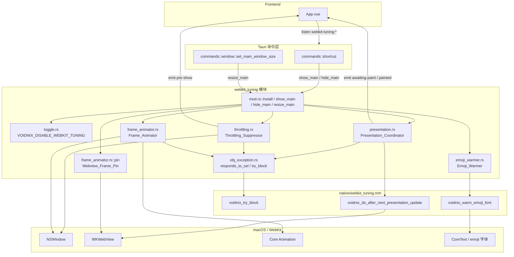
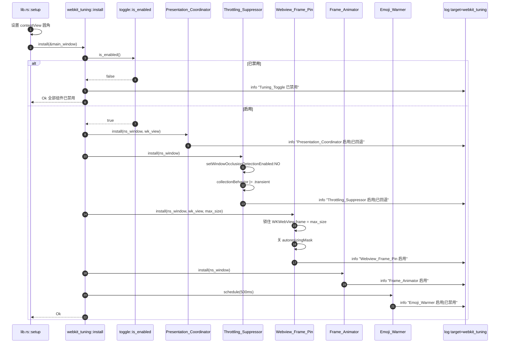
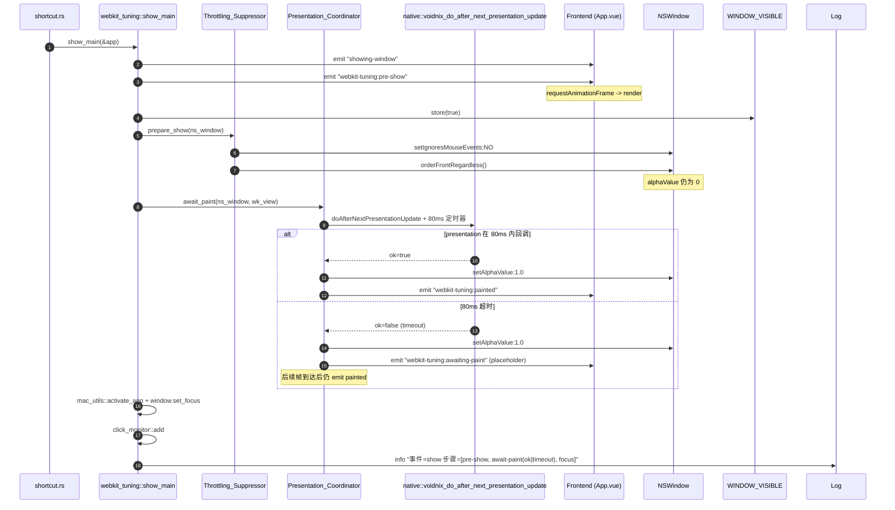
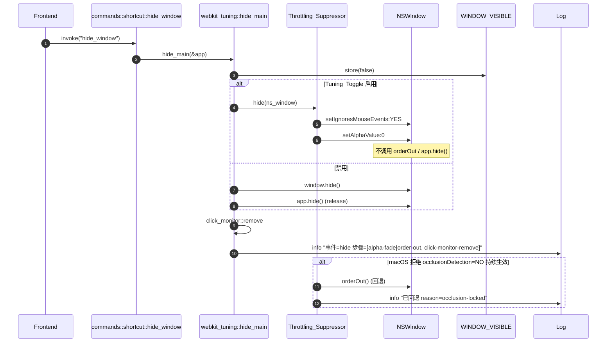
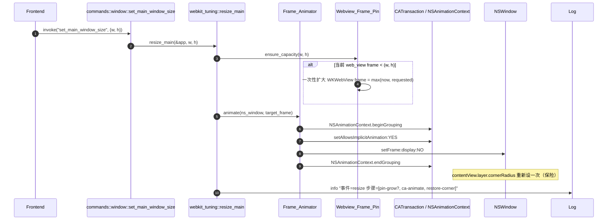
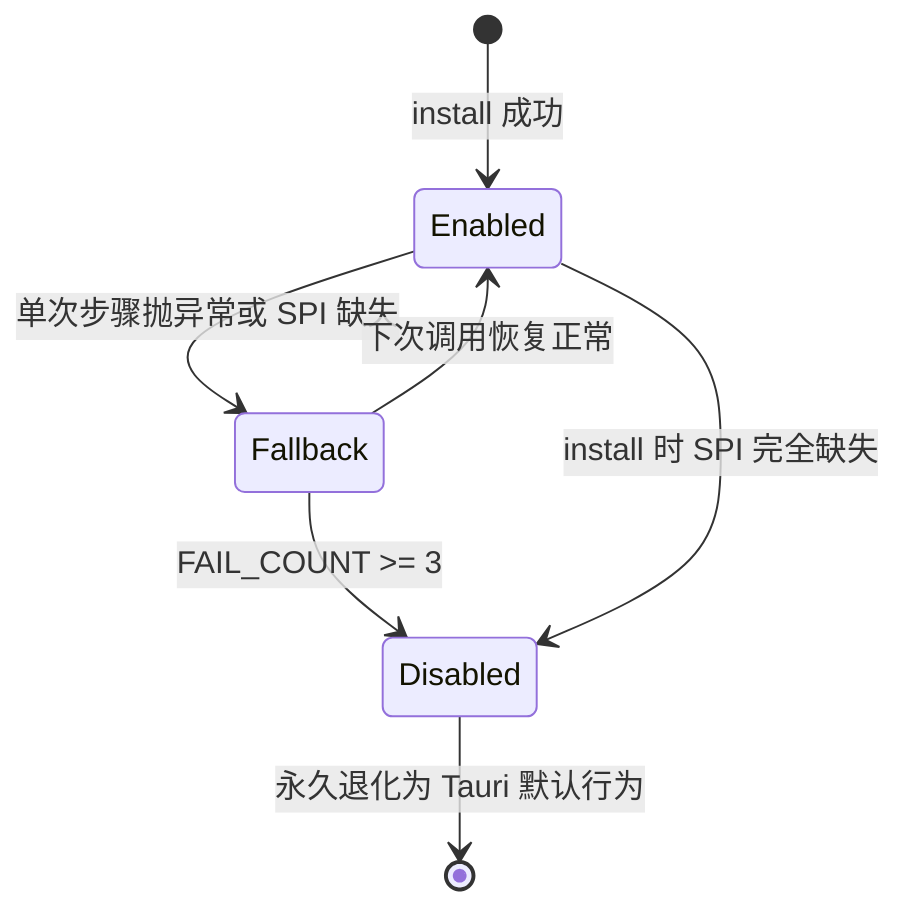
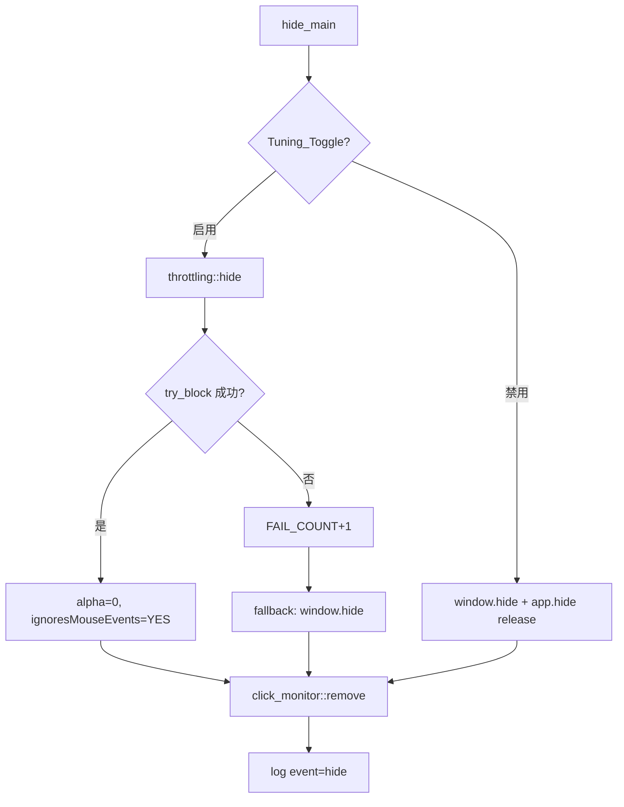

# Design Document

## Overview

本特性在 Voidnix 的 macOS 原生外壳上实装一组 WKWebView 呈现层驯化逻辑，使 Main_Window
在唤起、隐藏、尺寸变化与 emoji 渲染等场景达到原生启动器水平的视觉表现。整体实现路径如下：

- 新增独立 Rust 模块 `src-tauri/src/webkit_tuning/`，按 Glossary 名词拆分子模块；该模块
  在 `lib.rs` setup 阶段一次性 install，并对外暴露 `show_main` / `hide_main` /
  `resize_main` 三个高层入口，由 `commands::shortcut` 与新 Tauri command 调用。
- 新增 Objective‑C++ 桥接文件 `src-tauri/native/webkit_tuning.mm`，提供两类能力：
  (1) `voidnix_try_block(void (^)(void))` 包裹 `@try/@catch`，弥补 objc2 不能拦截 Obj‑C
  异常的缺陷；(2) `voidnix_do_after_next_presentation_update(WKWebView*, NSWindow*, void(^)(BOOL))`
  封装 `_doAfterNextPresentationUpdate:` 的 selector 探测、调用与 80ms 超时兜底。
- 用 `Tuning_Toggle`（读取 `VOIDNIX_DISABLE_WEBKIT_TUNING` 环境变量）在 install 阶段一次性
  决定是否启用，关闭时所有 install/show/hide/resize 入口退化为对原 Tauri 行为的直通。
- 通过 `log::info!(target = "webkit_tuning", ...)` 输出生效状态与每次事件的步骤列表，
  release 构建在未显式开启 `RUST_LOG=webkit_tuning=debug` 时由 `env_logger` 自然过滤。

整套逻辑只对 label 为 `main` 的窗口生效；`screenshot` 窗口现有 `alpha=0 + ignoresMouseEvents
+ orderFrontRegardless` 配置完全不动，且代码上由 install 入口的 label 守卫保证。

## Architecture

### 组件结构



### 数据流

show / hide / resize 三条主路径都贯穿 Toggle 守卫、Probe 探测、Native 桥接、Tauri 事件四
道层级，下面按事件类型给出细化时序图。

#### 初始化序列（lib.rs setup）



#### show 序列（替换 shortcut.rs::register_global_shortcut 中的 show 路径）



#### hide 序列（替换 shortcut.rs::hide_window）



#### resize 序列（新 Tauri command）



### 关键架构决策

- **Rust + Objective‑C++ 桥接而非纯 objc2**：`_doAfterNextPresentationUpdate:` 是 SPI，
  `responds_to_sel:` 在最坏情况下仍可能抛出 Obj‑C 异常；objc2 不能 catch Obj‑C 异常，
  且 `block2::RcBlock` 调用 SPI 出错时无法本地兜底。把这两段封进 `webkit_tuning.mm` 的 `@try`
  里，再以 C ABI 暴露给 Rust，是 Req 5.3 唯一可行的实现路径。
- **保留 alpha=0 而不是 orderOut**：Req 2.2/2.3/2.4 强制 hide 时不能让 WebKit 把窗口判定
  为 occluded；alpha=0 + ignoresMouseEvents 是 macOS 上最稳的方案，与现有 screenshot
  窗口完全同构。Req 2.6 担心的 Cmd+Tab/Mission Control 入口由 `LSUIElement=true` +
  `ActivationPolicy::Accessory` + 补充 `.transient` collectionBehavior 共同覆盖。
- **Webview_Frame_Pin 不动主窗口逻辑**：当前主窗口固定 720×480 不可 resize，Pin 在 install
  阶段把 WKWebView frame 锁到 conf 配置的最大尺寸并 disable autoresizing 即可；将来若有
  动态 resize 需求，`ensure_capacity` 提供一次性扩容能力。
- **回退状态机由组件自己持有**：每个组件有独立的 `AtomicU8 FAIL_COUNT`，3 次失败永久禁用
  对应步骤；其它组件不受影响。这避免了"一处坏全员退化"。
- **暴露事件而不是覆盖 NSView**：Req 1.6 要求超时 fallback 显示占位而非 Stale_Frame。原生
  侧不再贴 NSView 覆盖层（与 Tauri 透明窗口/CSS 圆角不兼容），改为发 Tauri 事件
  `webkit-tuning:awaiting-paint`，由前端在透明背景上自行渲染骨架/进度。

## Components and Interfaces

### 模块树

```
src-tauri/
├── build.rs                                  # 增加 webkit_tuning.mm 编译为静态库
├── native/
│   ├── awake_display.m                       # 不动
│   └── webkit_tuning.mm                      # 新增
└── src/
    ├── lib.rs                                # setup 处插入 webkit_tuning::install
    ├── commands/
    │   ├── shortcut.rs                       # hide_window / register_global_shortcut 接合点
    │   └── window.rs                         # 新增 set_main_window_size command
    └── webkit_tuning/                        # 新增模块
        ├── mod.rs                            # 顶层 install / show_main / hide_main / resize_main / state
        ├── toggle.rs                         # Tuning_Toggle
        ├── obj_exception.rs                  # selector 探测 + try_block FFI 封装
        ├── presentation.rs                   # Presentation_Coordinator
        ├── throttling.rs                     # Throttling_Suppressor
        ├── frame_animator.rs                 # Frame_Animator + Webview_Frame_Pin
        ├── emoji_warmer.rs                   # Emoji_Warmer
        └── log.rs                            # 统一 step 列表 / 事件日志辅助
```

### Tuning_Toggle (`toggle.rs`)

```rust
// src-tauri/src/webkit_tuning/toggle.rs
use once_cell::sync::Lazy;

static ENABLED: Lazy<bool> = Lazy::new(|| {
    std::env::var("VOIDNIX_DISABLE_WEBKIT_TUNING").as_deref() != Ok("1")
});

#[inline]
pub fn is_enabled() -> bool { *ENABLED }
```

Req 7.1/7.2 规定字符串值精确等于 `"1"` 才禁用，非 `"1"`、未设置、`"true"` 等一律走启用路径。

### 顶层入口 (`mod.rs`)

```rust
// src-tauri/src/webkit_tuning/mod.rs
pub mod toggle;
pub mod obj_exception;
pub mod presentation;
pub mod throttling;
pub mod frame_animator;
pub mod emoji_warmer;
pub(crate) mod log;

use tauri::{AppHandle, Manager, WebviewWindow};

pub fn install(window: &WebviewWindow) -> tauri::Result<()> {
    if !toggle::is_enabled() {
        log::component_status("Tuning_Toggle", log::Status::Disabled);
        return Ok(());
    }
    if window.label() != "main" { return Ok(()); }

    presentation::install(window);
    throttling::install(window);
    frame_animator::install(window);
    emoji_warmer::schedule(window);
    Ok(())
}

pub fn show_main(app: &AppHandle) {
    let mut steps: log::Steps = Default::default();
    if !toggle::is_enabled() { fallback_show(app, &mut steps); return; }
    let Some(window) = app.get_webview_window("main") else { return; };

    let _ = app.emit("showing-window", ());
    let _ = app.emit("webkit-tuning:pre-show", ());
    steps.push("pre-show");

    crate::commands::shortcut::set_window_visible(true);

    throttling::prepare_show(&window, &mut steps);
    presentation::await_paint(&window, &mut steps);

    crate::mac_utils::activate_app();
    let _ = window.set_focus();
    steps.push("focus");

    crate::commands::shortcut::add_click_monitor(app);
    log::event("show", &steps);
}

pub fn hide_main(app: &AppHandle) {
    let mut steps: log::Steps = Default::default();
    crate::commands::shortcut::set_window_visible(false);

    if let Some(window) = app.get_webview_window("main") {
        if toggle::is_enabled() {
            throttling::hide(&window, &mut steps);
        } else {
            let _ = window.hide();
            #[cfg(all(target_os = "macos", not(debug_assertions)))]
            let _ = app.hide();
            steps.push("legacy-hide");
        }
    }

    crate::commands::shortcut::remove_click_monitor();
    steps.push("click-monitor-remove");
    log::event("hide", &steps);
}

pub fn resize_main(app: &AppHandle, width: f64, height: f64) -> Result<(), String> {
    let mut steps: log::Steps = Default::default();
    let window = app.get_webview_window("main").ok_or("no main window")?;
    if toggle::is_enabled() {
        frame_animator::ensure_capacity(&window, width, height, &mut steps);
        frame_animator::animate(&window, width, height, &mut steps);
    } else {
        let _ = window.set_size(tauri::LogicalSize { width, height });
        steps.push("legacy-set-size");
    }
    log::event("resize", &steps);
    Ok(())
}
```

### Presentation_Coordinator (`presentation.rs`)

```rust
// src-tauri/src/webkit_tuning/presentation.rs
use std::sync::atomic::{AtomicU8, Ordering};

static FAIL_COUNT: AtomicU8 = AtomicU8::new(0);
const FAIL_LIMIT: u8 = 3;
const PAINT_TIMEOUT_MS: u64 = 80;

pub fn install(window: &WebviewWindow) {
    // 仅记录组件就绪状态。真正的 await_paint 在 show_main 中按需调用。
    log::component_status("Presentation_Coordinator", log::Status::Enabled);
}

pub fn await_paint(window: &WebviewWindow, steps: &mut log::Steps) {
    if FAIL_COUNT.load(Ordering::SeqCst) >= FAIL_LIMIT {
        steps.push("await-paint-disabled");
        unsafe { set_alpha(window, 1.0); }
        return;
    }
    let ns_window = unsafe { ns_window_ptr(window) };
    let wk_view = unsafe { wk_webview_ptr(window) };

    // 跨线程同步 channel；80ms 超时由 native 侧自带的 dispatch_after 兜底。
    let (tx, rx) = std::sync::mpsc::channel::<bool>();
    let block = block2::RcBlock::new(move |ok: bool| { let _ = tx.send(ok); });

    let invoked = unsafe {
        crate::native::voidnix_do_after_next_presentation_update(
            wk_view, ns_window, PAINT_TIMEOUT_MS, &*block,
        )
    };
    if !invoked {
        FAIL_COUNT.fetch_add(1, Ordering::SeqCst);
        steps.push("await-paint-spi-missing");
        unsafe { set_alpha(window, 1.0); }
        return;
    }
    let result = rx.recv_timeout(std::time::Duration::from_millis(PAINT_TIMEOUT_MS + 16))
        .unwrap_or(false);
    unsafe { set_alpha(window, 1.0); }
    if result {
        steps.push("await-paint-ok");
        let _ = window.app_handle().emit("webkit-tuning:painted", ());
    } else {
        steps.push("await-paint-timeout");
        let _ = window.app_handle().emit("webkit-tuning:awaiting-paint", ());
    }
}
```

### Throttling_Suppressor (`throttling.rs`)

```rust
// src-tauri/src/webkit_tuning/throttling.rs
pub fn install(window: &WebviewWindow) {
    crate::webkit_tuning::obj_exception::try_block(|| unsafe {
        let ns: &NSWindow = ns_window_ref(window);
        let _: () = msg_send![ns, setWindowOcclusionDetectionEnabled: false];
        let cb: NSWindowCollectionBehavior = ns.collectionBehavior();
        ns.setCollectionBehavior(cb | NSWindowCollectionBehavior::Transient);
    });
    log::component_status("Throttling_Suppressor", log::Status::Enabled);
}

pub fn prepare_show(window: &WebviewWindow, steps: &mut Steps) {
    unsafe {
        let ns: &NSWindow = ns_window_ref(window);
        let _: () = msg_send![ns, setIgnoresMouseEvents: false];
        ns.orderFrontRegardless();
    }
    steps.push("prepare-show");
}

pub fn hide(window: &WebviewWindow, steps: &mut Steps) {
    let ok = crate::webkit_tuning::obj_exception::try_block(|| unsafe {
        let ns: &NSWindow = ns_window_ref(window);
        let _: () = msg_send![ns, setIgnoresMouseEvents: true];
        ns.setAlphaValue(0.0);
    });
    if ok { steps.push("alpha-fade-hide"); }
    else  { unsafe { let _ = window.hide(); }; steps.push("fallback-orderOut"); }
}
```

### Frame_Animator + Webview_Frame_Pin (`frame_animator.rs`)

```rust
// src-tauri/src/webkit_tuning/frame_animator.rs
pub fn install(window: &WebviewWindow) {
    pin::install(window);
    log::component_status("Webview_Frame_Pin", log::Status::Enabled);
    log::component_status("Frame_Animator", log::Status::Enabled);
}

pub fn ensure_capacity(window: &WebviewWindow, w: f64, h: f64, steps: &mut Steps) {
    if pin::current_capacity(window).contains(w, h) { return; }
    pin::grow(window, w, h);
    steps.push("pin-grow");
}

pub fn animate(window: &WebviewWindow, w: f64, h: f64, steps: &mut Steps) {
    crate::webkit_tuning::obj_exception::try_block(|| unsafe {
        let ns: &NSWindow = ns_window_ref(window);
        let target = compute_target_frame(ns, w, h);
        // NSAnimationContext + 隐式 CA 动画
        let ctx: id = msg_send![class!(NSAnimationContext), currentContext];
        let _: () = msg_send![class!(NSAnimationContext), beginGrouping];
        let _: () = msg_send![ctx, setAllowsImplicitAnimation: true];
        let _: () = msg_send![ctx, setDuration: 0.18];
        let _: () = msg_send![ns, setFrame: target display: false animate: true];
        let _: () = msg_send![class!(NSAnimationContext), endGrouping];
        // 圆角保险（Req 3.5）
        re_apply_corner_radius(ns, 16.0);
    });
    steps.push("ca-animate");
}

mod pin {
    pub fn install(window: &WebviewWindow) {
        // 锁住 WKWebView frame = max_session_size，关闭 autoresizing
    }
    pub fn current_capacity(window: &WebviewWindow) -> Capacity { /* ... */ }
    pub fn grow(window: &WebviewWindow, w: f64, h: f64) { /* 一次性扩大 */ }
}
```

### Emoji_Warmer (`emoji_warmer.rs`)

```rust
// src-tauri/src/webkit_tuning/emoji_warmer.rs
pub fn schedule(window: &WebviewWindow) {
    let app = window.app_handle().clone();
    tauri::async_runtime::spawn(async move {
        tokio::time::sleep(std::time::Duration::from_millis(500)).await;
        // 切回主线程，保证 NSAttributedString 字体子系统初始化在主线程
        let _ = app.run_on_main_thread(move || {
            let ok = crate::webkit_tuning::obj_exception::try_block(|| unsafe {
                crate::native::voidnix_warm_emoji_font();
            });
            log::component_status(
                "Emoji_Warmer",
                if ok { log::Status::Enabled } else { log::Status::Disabled },
            );
        });
    });
}
```

native 侧 `voidnix_warm_emoji_font()` 内部把"准备 NSAttributedString → drawAtPoint 到 1×1
NSBitmapImageRep"分成多片，每片用 `dispatch_async(dispatch_get_main_queue, ...)` 串
联，单片硬上限 8ms（用 `mach_absolute_time` 自查）。

### Obj‑C 异常拦截与 selector 探测 (`obj_exception.rs`)

```rust
// src-tauri/src/webkit_tuning/obj_exception.rs
use objc2::sel;
use objc2::runtime::{AnyObject, Sel};

extern "C" {
    fn voidnix_try_block(block: &block2::Block<dyn Fn()>) -> bool; // true=正常 false=异常
}

pub fn try_block(f: impl FnOnce()) -> bool {
    let cell = std::cell::RefCell::new(Some(f));
    let block = block2::RcBlock::new(move || {
        if let Some(f) = cell.borrow_mut().take() { f(); }
    });
    unsafe { voidnix_try_block(&*block) }
}

pub fn responds_to_sel(obj: *mut AnyObject, sel: Sel) -> bool {
    if obj.is_null() { return false; }
    let mut answer = false;
    let _ = try_block(|| unsafe {
        let r: bool = objc2::msg_send![obj, respondsToSelector: sel];
        answer = r;
    });
    answer
}
```

### Native 桥 (`native/webkit_tuning.mm`)

```objc
// src-tauri/native/webkit_tuning.mm
#import <Foundation/Foundation.h>
#import <AppKit/AppKit.h>
#import <WebKit/WebKit.h>
#include <stdbool.h>

extern "C" bool voidnix_try_block(void (^block)(void)) {
    @try { block(); return true; }
    @catch (NSException *e) {
        NSLog(@"[webkit_tuning] caught Obj-C exception: %@ - %@", e.name, e.reason);
        return false;
    }
}

extern "C" bool voidnix_do_after_next_presentation_update(
    WKWebView *web, NSWindow *window, uint64_t timeout_ms, void (^cb)(bool ok)) {
    SEL sel = NSSelectorFromString(@"_doAfterNextPresentationUpdate:");
    if (![web respondsToSelector:sel]) { return false; }

    __block bool fired = false;
    void (^once)(bool) = ^(bool ok) {
        @synchronized (web) { if (fired) return; fired = true; }
        cb(ok);
    };

    @try {
        [web performSelector:sel withObject:^{ once(true); }];
    } @catch (NSException *e) {
        NSLog(@"[webkit_tuning] _doAfterNextPresentationUpdate threw: %@", e);
        return false;
    }
    dispatch_after(
        dispatch_time(DISPATCH_TIME_NOW, (int64_t)timeout_ms * NSEC_PER_MSEC),
        dispatch_get_main_queue(),
        ^{ once(false); }
    );
    return true;
}

extern "C" void voidnix_warm_emoji_font(void) {
    NSArray<NSString *> *probes = @[ @"😀", @"👋🏽", @"👨‍👩‍👧‍👦", @"🇨🇳", @"🧑‍💻" ];
    NSDictionary *attrs = @{
        NSFontAttributeName: [NSFont systemFontOfSize:14.0]
    };
    NSBitmapImageRep *rep = [[NSBitmapImageRep alloc]
        initWithBitmapDataPlanes:NULL pixelsWide:1 pixelsHigh:1
        bitsPerSample:8 samplesPerPixel:4 hasAlpha:YES isPlanar:NO
        colorSpaceName:NSDeviceRGBColorSpace bytesPerRow:0 bitsPerPixel:32];
    [NSGraphicsContext saveGraphicsState];
    [NSGraphicsContext setCurrentContext:[NSGraphicsContext graphicsContextWithBitmapImageRep:rep]];
    for (NSString *s in probes) {
        @try { [s drawAtPoint:NSZeroPoint withAttributes:attrs]; } @catch (...) {}
    }
    [NSGraphicsContext restoreGraphicsState];
}
```

### 与 Tauri command 的接合 (`commands/window.rs`)

```rust
// src-tauri/src/commands/window.rs (新文件)
#[tauri::command]
pub fn set_main_window_size(app: tauri::AppHandle, width: f64, height: f64) -> Result<(), String> {
    crate::webkit_tuning::resize_main(&app, width, height)
}
```

并在 `lib.rs` 的 `invoke_handler!` 中追加注册。

### build.rs 增量

```rust
// src-tauri/build.rs（仅追加）
let mm_obj = Path::new(&out_dir).join("webkit_tuning.o");
let lib_path = Path::new(&out_dir).join("libwebkit_tuning.a");

let s1 = Command::new("clang++")
    .args([
        "-c", "-fobjc-arc", "-fmodules", "-std=c++17",
        "-mmacosx-version-min=11.0",
        "-o", mm_obj.to_str().unwrap(),
        "native/webkit_tuning.mm",
    ])
    .status().expect("compile webkit_tuning.mm");
assert!(s1.success());

let s2 = Command::new("ar")
    .args(["rcs", lib_path.to_str().unwrap(), mm_obj.to_str().unwrap()])
    .status().expect("ar");
assert!(s2.success());

println!("cargo:rustc-link-search=native={}", out_dir);
println!("cargo:rustc-link-lib=static=webkit_tuning");
println!("cargo:rustc-link-lib=framework=WebKit");
println!("cargo:rustc-link-lib=framework=AppKit");
println!("cargo:rerun-if-changed=native/webkit_tuning.mm");
```

## Data Models

### 共享状态

```rust
// src-tauri/src/webkit_tuning/mod.rs
pub(crate) struct ComponentState {
    pub fail_count: std::sync::atomic::AtomicU8,
    pub status: std::sync::atomic::AtomicU8, // 0=Enabled 1=Fallback 2=Disabled
}

// 每个组件持有自己的 static
// presentation::FAIL_COUNT / throttling::FAIL_COUNT / frame_animator::FAIL_COUNT
// emoji_warmer 单次性，不计数

pub(crate) struct CapturedFrame {
    pub max_width: f64,
    pub max_height: f64,
}
```

`WINDOW_VISIBLE` 仍在 `commands/shortcut.rs`，由 `webkit_tuning::mod.rs` 通过两个新增的
pub(crate) helper 读写：

```rust
// commands/shortcut.rs
pub(crate) fn set_window_visible(v: bool) { WINDOW_VISIBLE.store(v, Ordering::SeqCst); }
pub(crate) fn add_click_monitor(app: &tauri::AppHandle) {
    #[cfg(target_os = "macos")] click_monitor::add(app);
}
```

### Tauri 事件契约（前端订阅点）

| 事件名 | payload | 触发时机 | 前端用途 |
| --- | --- | --- | --- |
| `showing-window` | `()` | 已存在；保留 | 抑制失焦自动隐藏 |
| `webkit-tuning:pre-show` | `()` | show 序列第一步 | rAF 触发渲染 |
| `webkit-tuning:awaiting-paint` | `()` | 80ms 超时 fallback | 透明骨架占位 |
| `webkit-tuning:painted` | `()` | presentation 已就绪 | 撤掉骨架 |

### 日志记录格式

```
target=webkit_tuning level=info component=Throttling_Suppressor status=启用
target=webkit_tuning level=info component=Presentation_Coordinator status=已回退 reason=spi-missing
target=webkit_tuning level=info event=show steps=[pre-show, prepare-show, await-paint-ok, focus]
target=webkit_tuning level=info event=hide steps=[alpha-fade-hide, click-monitor-remove]
target=webkit_tuning level=info event=resize steps=[ca-animate]
```


## Correctness Properties

*A property is a characteristic or behavior that should hold true across all valid executions of a system—essentially, a formal statement about what the system should do. Properties serve as the bridge between human-readable specifications and machine-verifiable correctness guarantees.*

下列属性已经过 prework 阶段的合并：原始的 24 条 acceptance criteria 中，可形式化为
universal property 的部分被归并到 11 条综合属性，其余按 example / edge-case / integration /
smoke 分类，详见 Testing Strategy。

### Property 1: Show 时 alpha 序列受 paint/timeout 因果约束

*For any* paint 回调延迟 `d ∈ [0ms, ∞]` 与任意进入 show 流程的 Main_Window 初始 alpha
值 `α₀`，令 `t_show` 为 show_main 入口时刻、`t_alpha₁` 为 NSWindow.alphaValue 被设为 1 的
时刻，则恒有 `t_alpha₁ ≤ t_show + min(d, 80ms) + ε`，且对一切 `t ∈ [t_show, t_alpha₁)`
有 `α(t) = 0`；当 `d ≤ 80ms` 时事件序列以 `webkit-tuning:painted` 收尾，否则先 emit
`webkit-tuning:awaiting-paint`，并在 `d` 真正到达时再 emit `painted`（若仍处于该 show
会话）。

**Validates: Requirements 1.1, 1.2, 1.6**

### Property 2: Show 仅作用于 Main_Window

*For any* WebviewWindow，若其 label 不等于 `"main"`，调用 `webkit_tuning::install` 与
`show_main` 在 native 桥上的调用次数恒为 0。

**Validates: Requirements 1.5**

### Property 3: Hide 后置条件不变量

*For any* show / hide 操作序列与任意 install 时机，每次 `hide_main` 返回后均满足：
`NSWindow.alphaValue == 0`、`NSWindow.ignoresMouseEvents == true`、`windowOcclusionDetectionEnabled == false`、`NSWindow.frame == 上一次 show 完成时的 frame`、累计 `orderOut` 调用次数 == 0、累计 `NSApplication.hide` 调用次数 == 0；且 hide 完成时刻
距离 hide 入口时刻 < 100ms。

**Validates: Requirements 2.1, 2.2, 2.5**

### Property 4: Show 时 pre-show 信号严格先于 alpha=1 且间距 ≤16ms

*For any* show 序列，记 `t_pre` 为 `webkit-tuning:pre-show` emit 时刻、`t_alpha₁` 同上，
则 `0 ≤ t_alpha₁ - t_pre ≤ 16ms`。

**Validates: Requirements 2.7**

### Property 5: collectionBehavior 始终包含 Transient

*For any* install 之后的 NSWindow 状态，对其 `collectionBehavior` 的取值均满足
`(value & NSWindowCollectionBehaviorTransient) != 0`。

**Validates: Requirements 2.6**

### Property 6: WKWebView frame 在 resize 序列中只增不减且覆盖历史峰值

*For any* resize 请求序列 `[(w₁, h₁), (w₂, h₂), …, (wₙ, hₙ)]`，记 `M_k = (max{w₁..wk}, max{h₁..hk})`，每次 `resize_main` 返回后均满足 `WKWebView.frame.size ≥ M_k`（按宽高分量）；
扩容次数（即 `WKWebView.frame.size` 实际改变的次数）等于 `M_k` 创新高的次数。

**Validates: Requirements 3.1, 3.3, 3.6**

### Property 7: Resize 后置条件不变量

*For any* resize 调用，调用返回后均满足：本次调用中 `NSAnimationContext.beginGrouping`
与 `endGrouping` 调用次数差为 0、`contentView.layer.cornerRadius == 16.0`、
`contentView.layer.masksToBounds == true`、`setAllowsImplicitAnimation:` 被设为 `true`。

**Validates: Requirements 3.2, 3.5**

### Property 8: try_block 对任意被包裹代码恒不向上抛

*For any* Rust 闭包 `f`（包括内部触发 Obj-C 抛 NSGenericException、NSInvalidArgumentException、
带任意 `reason` 的自定义异常或正常返回的所有情形），`obj_exception::try_block(f)` 都返回布
尔值（true=正常 / false=被捕获）而不 panic，且后续 install/show/hide/resize 路径仍能继续
执行剩余步骤。

**Validates: Requirements 5.3**

### Property 9: responds_to_sel 对任意 selector 名总不抛且不存在的 selector 返回 false

*For any* selector 字符串（含合法的现有方法名、不存在的方法名、含奇怪字符的字符串），
`obj_exception::responds_to_sel(obj, sel)` 都返回布尔值不 panic；且对运行时不存在该方法
的对象总返回 false。

**Validates: Requirements 5.4**

### Property 10: idle 期间无多余 CA 事务

*For any* 不包含 resize 调用的 show/hide 操作序列，序列结束后 `Frame_Animator` 自身贡献
的 `CATransaction.begin` 调用次数为 0。

**Validates: Requirements 6.3**

### Property 11: install/teardown 循环不残留 observer

*For any* `install → teardown` 循环次数 `N ≥ 0`，最后一次 teardown 后由 `webkit_tuning`
注册的 NSNotification + KVO observer 计数恒为 0。

**Validates: Requirements 6.4**

### Property 12: Tuning_Toggle 二值合同

*For any* 启动时 `VOIDNIX_DISABLE_WEBKIT_TUNING` 取值字符串 `s`，
`toggle::is_enabled() ↔ s != "1"`；当 `is_enabled()` 为 false 时，`install`、`show_main`、
`hide_main`、`resize_main` 在 native 桥上的调用次数累计为 0；当为 true 时调用次数与执行的
组件步骤数相等。

**Validates: Requirements 7.1, 7.2**

### Property 13: Install 阶段每个组件恰好一条状态日志

*For any* 失败注入组合（包含 SPI 不可用、try_block 失败、emoji 桥失败的笛卡尔积），install
完成后 `target=webkit_tuning` 收到的 component 日志条数等于已 install 的组件数（启用 toggle
时为 5：Tuning_Toggle 不计自身，统计 Presentation_Coordinator / Throttling_Suppressor /
Webview_Frame_Pin / Frame_Animator / Emoji_Warmer），每条 `status` 字段取值属于
`{"启用", "已回退", "已禁用"}`。

**Validates: Requirements 7.3**

### Property 14: 事件日志一一对应且写入耗时受限

*For any* show/hide/resize 事件序列 `[e₁..eₙ]`，序列结束后 `target=webkit_tuning` 收到的
`event=` 行数恰好为 n；且每条事件日志的写入耗时 ≤ 10ms。

**Validates: Requirements 7.4**

## Error Handling

按 Req 5 的回退要求，每个组件持有独立的失败计数器与状态机。

### 失败状态机



### 失败种类与处理

| 失败种类 | 触发位置 | 处理 | 日志 |
| --- | --- | --- | --- |
| `_doAfterNextPresentationUpdate:` selector 不存在 | `presentation::await_paint` 探测 | 直接 `setAlphaValue:1`，FAIL_COUNT+1 | `已回退 reason=spi-missing` |
| presentation 回调超时（80ms） | `presentation::await_paint` 等待 | emit `awaiting-paint` + `setAlphaValue:1` | `event=show steps=[..., await-paint-timeout]` |
| try_block 捕获 Obj-C 异常 | 任一组件 | 该步骤跳过，FAIL_COUNT+1，继续后续 | `已回退 reason=objc-exception` |
| `setWindowOcclusionDetectionEnabled:` 不被尊重 | `throttling::install` 之后 KVO 检测到值变化 | hide 路径切到 `orderOut:` 分支 | `已回退 reason=occlusion-locked` |
| Frame_Animator 抛异常 | `frame_animator::animate` | fallback 到直接 `setFrame:display:NO`（无动画），FAIL_COUNT+1 | `已回退 reason=animate-failed` |
| Webview_Frame_Pin grow 失败 | `frame_animator::ensure_capacity` | 跳过 grow，仍尝试 animate，FAIL_COUNT+1 | `已回退 reason=pin-grow-failed` |
| `voidnix_warm_emoji_font` 抛异常 | `emoji_warmer::schedule` | 直接放弃，状态置 Disabled | `已禁用 reason=warmer-failed` |
| FAIL_COUNT 达到 3 | 任一组件 | 该组件永久 Disabled，后续所有调用变成空操作 | `已禁用 reason=fail-count-exceeded` |
| `VOIDNIX_DISABLE_WEBKIT_TUNING == "1"` | toggle 检查 | 全部 install 跳过；show/hide/resize 走 Tauri 默认 | `Tuning_Toggle 已禁用` |
| 当前 window.label != "main" | install 入口 | 直接返回 Ok | 不输出（避免日志噪声） |

### Resize 失败兜底

`resize_main` 在 `frame_animator::animate` 失败后必须仍把窗口设为目标尺寸：

```rust
if !animate(&window, w, h, &mut steps) {
    // fallback：直接 setFrame，无动画
    let _ = window.set_size(tauri::LogicalSize { width: w, height: h });
    steps.push("fallback-set-size");
}
```

### Hide 路径回退



## Testing Strategy

### 双层测试

- **Unit / Property tests**（Rust，proptest）：命中 Property 1–14 的属性，使用 mock 桥注入
  确定行为，每个属性 ≥ 100 次随机迭代。
- **Integration tests**（前端 + 真实 WKWebView）：覆盖 Req 2.3 / 2.4 / 7.5 / 7.6 等需要真
  实 WebKit 行为或 env_logger 行为的条目。
- **手工 / 视觉验收**：覆盖 Req 1.3 / 1.4 / 3.4 / 4.3（视觉判定）以及 Req 5.1 / 6.1 / 6.2
  （多版本/资源占用 smoke）。

### Mock 设计

为支持上述 PBT，在 `src-tauri/src/webkit_tuning/` 引入两个轻量抽象（仅在 `cfg(test)` 下用
mock 实现替换）：

```rust
// 受控对象：抽象 NSWindow / WKWebView 状态字段，用 trait 解耦
#[cfg_attr(test, mockall::automock)]
pub(crate) trait WindowOps {
    fn alpha(&self) -> f64;
    fn set_alpha(&self, v: f64);
    fn frame(&self) -> Frame;
    fn set_frame(&self, f: Frame, animated: bool);
    fn ignores_mouse(&self) -> bool;
    fn set_ignores_mouse(&self, v: bool);
    fn order_out_count(&self) -> u32;
    fn occlusion_detection(&self) -> bool;
    fn set_occlusion_detection(&self, v: bool);
    fn collection_behavior(&self) -> u64;
    fn set_collection_behavior(&self, v: u64);
}

#[cfg_attr(test, mockall::automock)]
pub(crate) trait PresentationBridge {
    /// 模拟 voidnix_do_after_next_presentation_update：
    /// 由测试控制 paint 投递延迟与 SPI 是否可用。
    fn schedule(&self, timeout_ms: u64, cb: Box<dyn FnOnce(bool) + Send>) -> bool;
}
```

在生产构建中，`WindowOps` 由 `RealWindow`（直接 `objc2::msg_send!`）实现；在 PBT 中由
`MockWindow`（内存字段 + 计数器）实现。这样 Property 1–7 不依赖真实 WKWebView 即可运行
≥100 次。

### Property Test 库与配置

- **库**：`proptest`（已是 Rust PBT 事实标准；纯 Rust，免 macOS 真机依赖）。
- **迭代**：每条 property test 使用 `#[proptest(cases = 256)]` 或全局 `PROPTEST_CASES=256`
  环境变量；最低 100 次。
- **标签**：每条 PBT 注释里写
  `// Feature: webkit-presentation-tuning, Property N: <property text>`。
- **路径**：`src-tauri/src/webkit_tuning/<sub>.rs` 对应的 `#[cfg(test)] mod tests` 与
  `src-tauri/tests/webkit_tuning_props.rs` 集成测试。

每条 Property 仅由一个对应的 property test 实现，输入策略示意：

| Property | 输入策略 |
| --- | --- |
| 1 | `(d_ms in 0u64..200, paint_will_arrive in proptest::bool::ANY)` |
| 2 | `label in proptest::sample::select(vec!["main", "screenshot", "x", ""])` |
| 3 | `ops in vec(prop_oneof![Just(Op::Show), Just(Op::Hide)], 0..32)` |
| 4 | 同 1 的 show 场景，断言 emit 与 alpha 时序 |
| 5 | 同 3 |
| 6 | `sizes in vec((10f64..2000.0, 10f64..1500.0), 0..16)` |
| 7 | `sizes in vec(...)` 同 6 |
| 8 | `errors in vec(prop_oneof![Just(EvilOp::None), Just(EvilOp::ThrowGeneric), Just(EvilOp::ThrowInvalid), Just(EvilOp::ThrowCustom)], 1..16)` |
| 9 | `selectors in vec("[A-Za-z_:0-9 ]{0,64}", 1..32)` |
| 10 | 同 3，事件序列中不包含 Resize |
| 11 | `n in 0u32..32` |
| 12 | `s in proptest::option::of("[\\PC]{0,16}")` |
| 13 | 失败注入笛卡尔积 |
| 14 | `events in vec(prop_oneof![Just(Ev::Show), Just(Ev::Hide), Just(Ev::Resize(...))], 0..32)` |

### Example / Edge-case / Integration / Smoke 测试

| 验证目标 | 测试类型 | 实现 |
| --- | --- | --- |
| Req 1.3 / 1.4 不出现 Stale_Frame / 白边 | 手工 | 录屏 + 60Hz 抽帧比对 |
| Req 2.3 rAF 隐藏期间 ≥30Hz | INTEGRATION | 前端起隐藏窗口、JS 跑 5s rAF 计数后通过 invoke 回报，断言 ≥150 次 |
| Req 2.4 setTimeout 漂移 ≤50ms | INTEGRATION | 前端在隐藏期间安排 100ms 间隔的 timer，30 次后断言最大漂移 ≤50ms |
| Req 2.6 Mission Control / Cmd+Tab / Dock | 手工 | 真机检查；Property 5 已自动覆盖 collectionBehavior 配置 |
| Req 2.8 occlusion-locked 回退 | EDGE_CASE | 单元测试用 mock 让 occlusion 字段被外部恢复，断言 hide 调 orderOut + 日志 |
| Req 3.4 圆角内白边 | 手工 | 录屏比对 |
| Req 4.1 Emoji_Warmer 触发一次 | EXAMPLE | 单元测试 mock 桥调用计数 == 1 |
| Req 4.2 主线程 ≤8ms | EXAMPLE | 本地基准；CI 不强 gate |
| Req 4.3 含 emoji 同帧渲染 | 手工 | 真机首次打开剪贴板视图比对 |
| Req 4.4 Emoji_Warmer 失败不阻塞 | EDGE_CASE | 注入桥失败，断言主流程 Ok + 日志 已禁用 |
| Req 5.1 macOS 13/14/15/26 启动不崩溃 | SMOKE | CI 多 runner（覆盖能拿到的版本）+ 手工 26 |
| Req 5.2 SPI 不可用回退 | EDGE_CASE | 单元测试注入 `voidnix_do_after_next_presentation_update` 返回 false，断言 fallback 路径 |
| Req 6.1 无持续轮询线程 | SMOKE | 启动后采样 NSThread 计数，与基线对比 |
| Req 6.2 RSS ≤10MB | SMOKE | 本地基准 |
| Req 7.5 release 静默 | INTEGRATION | release binary 跑 RUST_LOG="" + RUST_LOG="info"，断言 stderr 不含 webkit_tuning |
| Req 7.6 RUST_LOG=webkit_tuning=debug 输出 | INTEGRATION | release binary 跑 RUST_LOG=webkit_tuning=debug，断言 stderr 含日志 |

### 测试执行约定

- 单元 / property tests：`cargo test --lib --features webkit_tuning_mock`
  （在 `Cargo.toml` 引入 `[features] webkit_tuning_mock = ["mockall"]`）。
- 集成 tests：`cargo test --test webkit_tuning_props`，`PROPTEST_CASES=256`。
- 视觉手工：作为 release 前的 checklist，不 gate CI。

## 与现有代码的接合点

### 修改清单

| 文件 | 改动类型 | 说明 |
| --- | --- | --- |
| `src-tauri/Cargo.toml` | 追加 | 新 features `webkit_tuning_mock`、test-only dev-deps `proptest`、`mockall` |
| `src-tauri/build.rs` | 追加 | 编译 `native/webkit_tuning.mm` → 静态库并 `rustc-link-lib=static=webkit_tuning`；额外 `link-lib=framework=WebKit` |
| `src-tauri/native/webkit_tuning.mm` | 新增 | `voidnix_try_block`、`voidnix_do_after_next_presentation_update`、`voidnix_warm_emoji_font` |
| `src-tauri/src/lib.rs` | 修改 | 1) 在 `mod` 列表加入 `mod webkit_tuning;` 与 `mod commands::window;`；2) `setup` 中"contentView 圆角设置之后"插入 `webkit_tuning::install(&main_window)?;`；3) `invoke_handler!` 新增 `commands::window::set_main_window_size` |
| `src-tauri/src/commands/shortcut.rs` | 修改 | 1) `pub(crate) fn set_window_visible / add_click_monitor / remove_click_monitor` 三个 helper 暴露给 `webkit_tuning`；2) `hide_window` 替换为 `crate::webkit_tuning::hide_main(&app)`；3) `register_global_shortcut` 中现有的 `emit("showing-window") → store(true) → app.show / window.show / activate / set_focus / click_monitor::add` 一段（包括 translate 分支与默认分支）替换为 `crate::webkit_tuning::show_main(&app_handle)` |
| `src-tauri/src/commands/window.rs` | 新增 | `set_main_window_size` Tauri command |
| `src/App.vue` | 修改 | 监听 `webkit-tuning:pre-show`：触发 `requestAnimationFrame`；可选监听 `awaiting-paint` / `painted` 用于骨架占位 |
| `tauri.conf.json` | 不动 | 主窗口尺寸/可见性配置不变 |

### 精确插入位置（lib.rs）

现有代码：

```rust
if let Some(content_view) = ns_window.contentView() {
    let _: () = unsafe { objc2::msg_send![&content_view, setWantsLayer: true] };
    let layer: *mut objc2::runtime::AnyObject = unsafe { objc2::msg_send![&content_view, layer] };
    if !layer.is_null() {
        let _: () = unsafe { objc2::msg_send![layer, setCornerRadius: 16.0_f64] };
        let _: () = unsafe { objc2::msg_send![layer, setMasksToBounds: true] };
    }
}
// ▼ 在此处插入
crate::webkit_tuning::install(&window)?;
```

### 精确替换位置（shortcut.rs）

`hide_window`：

```rust
#[tauri::command]
pub fn hide_window(app: AppHandle) {
    crate::webkit_tuning::hide_main(&app);
}
```

`register_global_shortcut` 中两处 show 路径（translate 分支与默认 `if window_hidden` 分
支）由如下 6 行：

```rust
let _ = app_handle.emit("showing-window", ());
WINDOW_VISIBLE.store(true, Ordering::SeqCst);
#[cfg(all(target_os = "macos", not(debug_assertions)))]
let _ = app_handle.show();
if let Some(window) = app_handle.get_webview_window("main") { let _ = window.show(); }
crate::mac_utils::activate_app();
if let Some(window) = app_handle.get_webview_window("main") { let _ = window.set_focus(); }
#[cfg(target_os = "macos")] click_monitor::add(&app_handle);
```

替换为单行：

```rust
crate::webkit_tuning::show_main(&app_handle);
```

translate 分支保留 `set_window_visible(true)` 与 `add_click_monitor` 的语义，由
`show_main` 内部处理；前置的 ax_text/inject_copy 与后置的 `translate-text-ready` 后台线程
不动。

### 前端改动（App.vue）

在 `onMounted` 内补：

```typescript
const unlistenPreShow = await listen('webkit-tuning:pre-show', () => {
  requestAnimationFrame(() => { /* 触发同步 layout，避免首帧白底 */ })
})
const unlistenAwaiting = await listen('webkit-tuning:awaiting-paint', () => {
  appStore.showPaintSkeleton = true
})
const unlistenPainted = await listen('webkit-tuning:painted', () => {
  appStore.showPaintSkeleton = false
})
```

并在 `onUnmounted` 解除监听。`appStore.showPaintSkeleton` 默认 false，骨架样式由后续任务
确定（不在本特性的 UI 改动范围）。
