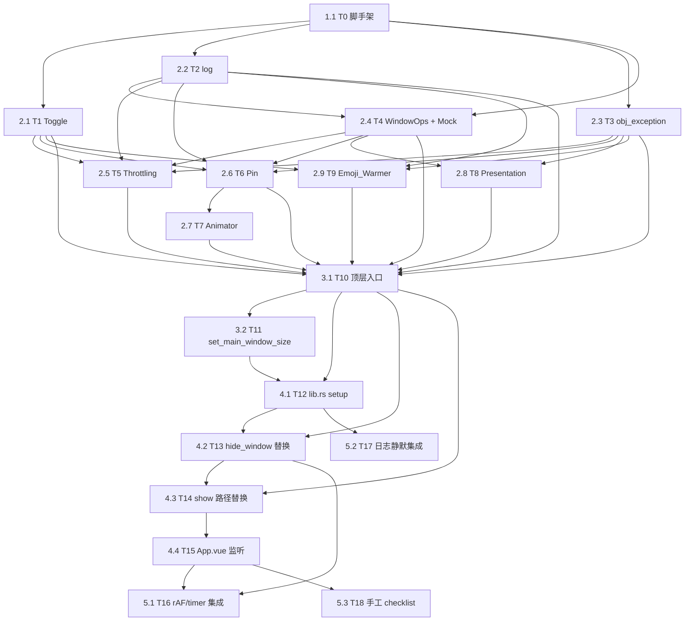

# Implementation Plan: webkit-presentation-tuning

## Overview

Convert the feature design into a series of prompts for a code-generation LLM
that will implement each step with incremental progress. Make sure that each
prompt builds on the previous prompts, and ends with wiring things together.
There should be no hanging or orphaned code that isn't integrated into a
previous step. Focus ONLY on tasks that involve writing, modifying, or testing
code.

按 design.md 模块树拆分，PBT 优先（每个组件先实装 mock + property test，再
接真实 native 桥）。所有 webkit_tuning 子组件全部就绪后才动 lib.rs::setup 与
shortcut.rs，避免半成品破坏现有窗口生命周期。

## Tasks

- [x] 1. 基础设施
  - [x] 1.1 T0：工程脚手架（build.rs + Cargo.toml + 空 mod 树 + native/.mm 占位）
    - 文件：`src-tauri/Cargo.toml`、`src-tauri/build.rs`、`src-tauri/native/webkit_tuning.mm`、`src-tauri/src/webkit_tuning/{mod,toggle,log,obj_exception,presentation,throttling,frame_animator,emoji_warmer}.rs`、`src-tauri/src/commands/window.rs`、`src-tauri/src/commands/mod.rs`
    - Cargo.toml 追加 `[features] webkit_tuning_mock = ["mockall"]`、`[dev-dependencies] proptest = "1"`、`mockall = "0.13"`
    - build.rs 追加 `clang++ -fobjc-arc -fmodules -std=c++17 -mmacosx-version-min=11.0` 编译 `webkit_tuning.mm` → `libwebkit_tuning.a`，并 `rustc-link-lib=static=webkit_tuning` + `framework=WebKit` + `framework=AppKit`
    - mod 树仅放空 `pub mod` 与函数签名占位（`fn install`、`fn show_main`、`fn hide_main`、`fn resize_main` 返回 Ok/()）；`webkit_tuning.mm` 仅含 `extern "C" bool voidnix_try_block(void(^)(void))` 等三个空壳
    - Validates Requirements: 5.1
    - Properties: —
    - Acceptance: `cd src-tauri && cargo check` 通过；`cargo build --release` 通过；`cargo test --features webkit_tuning_mock` 在 0 测试下通过；`nm libwebkit_tuning.a | grep voidnix_` 列出三个符号
    - 依赖：—

- [x] 2. webkit_tuning 子组件
  - [x] 2.1 T1：Tuning_Toggle（once_cell::Lazy<bool>）
    - 文件：`src-tauri/src/webkit_tuning/toggle.rs`
    - 实装 `static ENABLED: Lazy<bool>` 读 `VOIDNIX_DISABLE_WEBKIT_TUNING`，仅 `"1"` 视为禁用；暴露 `pub fn is_enabled() -> bool`
    - 在 `cfg(test)` 下提供 `pub(crate) fn override_enabled(v: bool)` 供 PBT 注入
    - Property 12 PBT：`s in proptest::option::of("[\\PC]{0,16}")`，断言 `is_enabled() ↔ s != Some("1")`
    - Validates Requirements: 7.1, 7.2
    - Properties: 12
    - Acceptance: `cargo test --features webkit_tuning_mock toggle` 通过；Property 12 在 `PROPTEST_CASES=256` 下通过
    - 依赖：1.1

  - [x] 2.2 T2：log.rs（Steps、component_status、event）
    - 文件：`src-tauri/src/webkit_tuning/log.rs`
    - 定义 `pub(crate) type Steps = SmallVec<[&'static str; 8]>` 或 `Vec<&'static str>`、`pub enum Status { Enabled, Fallback, Disabled }`、`pub fn component_status(name: &str, status: Status, reason: Option<&str>)`、`pub fn event(name: &str, steps: &Steps)`，全部走 `log::info!(target: "webkit_tuning", ...)`，输出格式与 design.md「日志记录格式」一致
    - 写入耗时上限：内部 `Instant::now()` 自查，>10ms 触发 debug_assert
    - 单元测试：用 `log::set_logger` + 自定义 sink，断言 `target == "webkit_tuning"`、`component=` 行 `status` 取值属于 `{"启用","已回退","已禁用"}`、`event=` 行 `steps=[...]` 顺序与传入一致
    - Validates Requirements: 7.3, 7.4
    - Properties: —（P13/P14 留到 T10 跨组件验证）
    - Acceptance: `cargo test log::tests` 通过；单元测试覆盖三种 status 与 event 输出
    - 依赖：1.1

  - [x] 2.3 T3：obj_exception.rs + native::voidnix_try_block + responds_to_sel + PBT
    - 文件：`src-tauri/src/webkit_tuning/obj_exception.rs`、`src-tauri/native/webkit_tuning.mm`（实装 `voidnix_try_block`）
    - native 侧：`extern "C" bool voidnix_try_block(void (^block)(void))` 用 `@try/@catch (NSException *)` 包裹，捕获后 NSLog 并返回 false
    - Rust 侧：`pub fn try_block(f: impl FnOnce()) -> bool`（用 `block2::RcBlock` + `RefCell<Option<F>>` 把 `FnOnce` 转为可调用 block）；`pub fn responds_to_sel(obj: *mut AnyObject, sel: Sel) -> bool` 内部用 `try_block` 包 `respondsToSelector:`
    - Property 8 PBT：`errors in vec(prop_oneof![Just(EvilOp::None), Just(EvilOp::ThrowGeneric), Just(EvilOp::ThrowInvalid), Just(EvilOp::ThrowCustom)], 1..16)`；用 `voidnix_test_throw(kind)` 辅助 native 函数触发不同异常；断言 `try_block` 对所有输入返回 bool 而不 panic，且后续 try_block 仍能继续工作
    - Property 9 PBT：`selectors in vec("[A-Za-z_:0-9 ]{0,64}", 1..32)`；断言 `responds_to_sel` 对任意字符串返回 bool 不 panic，且对运行时不存在的方法返回 false
    - Validates Requirements: 5.3, 5.4
    - Properties: 8, 9
    - Acceptance: `cargo test --features webkit_tuning_mock obj_exception` 通过；Property 8、9 在 ≥256 次迭代下通过
    - 依赖：1.1

  - [x] 2.4 T4：WindowOps trait + RealWindow + MockWindow（cfg(test)）+ PresentationBridge trait
    - 文件：`src-tauri/src/webkit_tuning/mod.rs`（trait + RealWindow），`src-tauri/src/webkit_tuning/test_support.rs`（cfg(test) MockWindow / MockPresentationBridge / 计数器）
    - `pub(crate) trait WindowOps`：`alpha/set_alpha/frame/set_frame/ignores_mouse/set_ignores_mouse/order_out_count/occlusion_detection/set_occlusion_detection/collection_behavior/set_collection_behavior/content_view_corner_radius/set_content_view_corner_radius/content_view_masks_to_bounds/set_content_view_masks_to_bounds/wkwebview_frame/set_wkwebview_frame/observer_count`
    - `pub(crate) trait PresentationBridge`：`fn schedule(&self, web: WkRef, win: WinRef, timeout_ms: u64, cb: Box<dyn FnOnce(bool) + Send>) -> bool`
    - `RealWindow` 实装基于 `objc2::msg_send!` + `obj_exception::try_block` 兜底
    - `MockWindow`（mockall + 内存字段）：记录 `setFrame/setAlpha/orderOut/setIgnoresMouseEvents/CATransaction.begin` 计数与时间戳；`MockPresentationBridge` 由测试控制 `paint_will_arrive: bool` 与 `delay_ms: u64`
    - Validates Requirements: 5.3（间接）
    - Properties: —
    - Acceptance: `cargo test --features webkit_tuning_mock` 通过；MockWindow 实现 `WindowOps` 全部方法；Drop 时打印未消费的 expectation
    - 依赖：1.1, 2.2

  - [x] 2.5 T5：Throttling_Suppressor + PBT
    - 文件：`src-tauri/src/webkit_tuning/throttling.rs`
    - install：`setWindowOcclusionDetectionEnabled:NO` + `collectionBehavior |= .Transient`，全部包在 `obj_exception::try_block` 内；失败 FAIL_COUNT+1，3 次永久 Disabled
    - prepare_show：`setIgnoresMouseEvents:NO` + `orderFrontRegardless()`；步骤名 `"prepare-show"`
    - hide：`setIgnoresMouseEvents:YES` + `setAlphaValue:0`；不调 `orderOut`/`app.hide`；try_block 失败时 fallback 到 `window.hide()` 并日志 `已回退 reason=occlusion-locked`
    - Property 3 PBT：`ops in vec(prop_oneof![Just(Op::Show(d_ms in 0u64..200)), Just(Op::Hide)], 0..32)` 驱动 MockWindow，断言每次 hide 后 `alpha == 0` `ignores_mouse == true` `occlusion_detection == false` `frame == 上次 show 后 frame` `order_out_count == 0` `app_hide_count == 0`，且 hide 完成耗时 < 100ms
    - Property 4 PBT：show 序列断言 `t_alpha₁ - t_pre ∈ [0, 16ms]`（用 MockWindow 的时间戳 + MockPresentationBridge 的同步回调）
    - Property 5 PBT：install 后任意操作下 `collection_behavior & Transient != 0`
    - 边界用例（非 PBT 的单元测试）：mock 让 occlusion 字段被外部恢复，断言 hide 切到 `orderOut` 分支并写 `已回退 reason=occlusion-locked` 日志（Req 2.8）
    - Validates Requirements: 2.1, 2.2, 2.5, 2.6, 2.7, 2.8
    - Properties: 3, 4, 5
    - Acceptance: `cargo test --features webkit_tuning_mock throttling` 通过；Property 3、4、5 在 ≥256 次迭代下通过
    - 依赖：2.1, 2.2, 2.3, 2.4

  - [x] 2.6 T6：Webview_Frame_Pin + PBT
    - 文件：`src-tauri/src/webkit_tuning/frame_animator.rs`（仅 `pub(crate) mod pin` 子模块，`animate` 留到 T7）
    - install：把 WKWebView frame 锁到 `tauri.conf.json` 配置的 main 窗口最大尺寸（720×480 起步），关 autoresizingMask
    - `current_capacity(window) -> Capacity`、`grow(window, w, h)`：一次性扩大 WKWebView frame 至 `max(now, requested)`
    - `ensure_capacity(window, w, h, &mut steps)`：如需扩容则 `steps.push("pin-grow")`
    - Property 6 PBT：`sizes in vec((10f64..2000.0, 10f64..1500.0), 0..16)` 驱动 MockWindow；断言每次返回后 `wkwebview_frame.size ≥ M_k`，扩容次数等于 `M_k` 创新高的次数
    - Validates Requirements: 3.1, 3.3, 3.6
    - Properties: 6
    - Acceptance: `cargo test --features webkit_tuning_mock pin` 通过；Property 6 在 ≥256 次迭代下通过
    - 依赖：2.1, 2.2, 2.3, 2.4

  - [x] 2.7 T7：Frame_Animator + PBT
    - 文件：`src-tauri/src/webkit_tuning/frame_animator.rs`（追加 `pub fn animate` 与 `pub fn install` 顶层入口）
    - animate：`NSAnimationContext.beginGrouping → setAllowsImplicitAnimation:YES → setDuration:0.18 → setFrame:display:NO animate:YES → endGrouping`，全部包在 `try_block`；末尾重设 `contentView.layer.cornerRadius = 16.0`、`masksToBounds = true`（保险）
    - 失败兜底：try_block 返回 false 时回退到 `window.set_size`，`steps.push("fallback-set-size")`，FAIL_COUNT+1
    - Property 7 PBT：`sizes in vec(...)` 多次 resize；断言 `beginGrouping/endGrouping` 计数差 == 0、`cornerRadius == 16.0`、`masksToBounds == true`、`setAllowsImplicitAnimation` 被调过且最后一次为 true
    - Property 10 PBT：`ops in vec(prop_oneof![Just(Op::Show), Just(Op::Hide)], 0..32)`（不含 Resize）；断言 Frame_Animator 自身贡献的 `CATransaction.begin` 调用次数 == 0
    - Validates Requirements: 3.2, 3.5, 6.3
    - Properties: 7, 10
    - Acceptance: `cargo test --features webkit_tuning_mock frame_animator` 通过；Property 7、10 在 ≥256 次迭代下通过
    - 依赖：2.6

  - [x] 2.8 T8：Presentation_Coordinator + 80ms 超时桥 + PBT
    - 文件：`src-tauri/src/webkit_tuning/presentation.rs`、`src-tauri/native/webkit_tuning.mm`（追加 `voidnix_do_after_next_presentation_update`）
    - native：`SEL = NSSelectorFromString(@"_doAfterNextPresentationUpdate:")`，`respondsToSelector` 不通过即返回 false；通过即 `performSelector` + `dispatch_after(timeout_ms)` 兜底；用 `__block bool fired` + `@synchronized` 保证 once 语义；整段在 `@try/@catch`
    - Rust 侧 `await_paint(window, &mut steps)`：通过 `PresentationBridge::schedule` 拿 ok=true/false，`set_alpha(1.0)`，按结果 emit `webkit-tuning:painted` 或 `webkit-tuning:awaiting-paint`，FAIL_COUNT+1 / SPI 缺失走 `await-paint-spi-missing` 步骤
    - Property 1 PBT：`(d_ms in 0u64..200, paint_will_arrive in any::<bool>())` 驱动 MockPresentationBridge；断言 `t_alpha₁ ≤ t_show + min(d, 80) + ε`、`α(t) == 0 for t ∈ [t_show, t_alpha₁)`、`d ≤ 80` 时事件序列以 `painted` 收尾，否则先 `awaiting-paint` 再（在 `d` 到达后仍处于该 show 会话时）`painted`
    - Property 2 PBT：`label in select(vec!["main","screenshot","x",""])`，断言 `label != "main"` 时 native 桥调用次数恒为 0
    - Validates Requirements: 1.1, 1.2, 1.5, 1.6, 5.2
    - Properties: 1, 2
    - Acceptance: `cargo test --features webkit_tuning_mock presentation` 通过；Property 1、2 在 ≥256 次迭代下通过；SPI 缺失（`schedule` 返回 false）走 fallback 路径并写日志 `已回退 reason=spi-missing`
    - 依赖：2.3, 2.4

  - [x] 2.9 T9：Emoji_Warmer + native::voidnix_warm_emoji_font
    - 文件：`src-tauri/src/webkit_tuning/emoji_warmer.rs`、`src-tauri/native/webkit_tuning.mm`（追加 `voidnix_warm_emoji_font`）
    - native：分片 `dispatch_async(dispatch_get_main_queue, ...)` 串联多个 emoji 探针 `[s drawAtPoint:NSZeroPoint withAttributes:attrs]` 到 1×1 NSBitmapImageRep；单片用 `mach_absolute_time` 自查 ≤8ms；最外层 `@try/@catch`
    - Rust：`schedule(window)` `tauri::async_runtime::spawn` 500ms 后 `app.run_on_main_thread` 调 `voidnix_warm_emoji_font`，`try_block` 兜底；写组件状态日志（`启用` / `已禁用 reason=warmer-failed`）
    - 单元测试：mock 桥调用计数 == 1（Req 4.1）；注入桥失败（让 `try_block` 返回 false）断言主流程 Ok 且日志 `已禁用`（Req 4.4）
    - Validates Requirements: 4.1, 4.2, 4.4
    - Properties: —（4.2 主线程 ≤8ms 由 native 自查 + 本地基准，不 PBT；4.3 视觉判定走 T18 手工 checklist）
    - Acceptance: `cargo test --features webkit_tuning_mock emoji_warmer` 通过；至少 2 条单元测试覆盖正常 + 失败注入两条路径
    - 依赖：2.1, 2.2, 2.3

- [x] 3. 顶层入口
  - [x] 3.1 T10：webkit_tuning::install/show_main/hide_main/resize_main 顶层入口 + 跨组件 PBT
    - 文件：`src-tauri/src/webkit_tuning/mod.rs`
    - 实装四个公开函数与设计文档伪代码一致：`install` 走 toggle 守卫 + label 守卫 + 5 个组件 install；`show_main` 顺序为 emit `showing-window` → emit `webkit-tuning:pre-show` → `set_window_visible(true)` → `throttling::prepare_show` → `presentation::await_paint` → `mac_utils::activate_app` → `window.set_focus` → `add_click_monitor` → `log::event("show", &steps)`；`hide_main`、`resize_main` 同 design.md
    - install/teardown observer 计数：用 `WindowOps::observer_count` 在 `install`/`uninstall_for_test` 配对；teardown 仅在 cfg(test) 暴露
    - Property 2 重复（label 守卫）+ Property 4（pre-show ↔ alpha=1 ≤16ms 跨 throttling+presentation）放本任务集中验证
    - Property 11 PBT：`n in 0u32..32` 次 `install → uninstall_for_test`，断言最后 observer_count == 0
    - Property 13 PBT：失败注入笛卡尔积（SPI 缺失 / try_block 失败 / emoji 桥失败 / occlusion 锁定 / Frame_Animator 抛异常）；断言 install 完成后收到的 `component=` 日志条数 == 5（toggle 启用时），每条 status ∈ `{"启用","已回退","已禁用"}`
    - Property 14 PBT：`events in vec(prop_oneof![Just(Ev::Show), Just(Ev::Hide), Just(Ev::Resize(w,h))], 0..32)` 顺序执行；断言 `event=` 行数恰好为 n 且每行写入耗时 ≤10ms
    - Validates Requirements: 1.5, 6.4, 7.3, 7.4
    - Properties: 2, 4, 11, 13, 14
    - Acceptance: `cargo test --features webkit_tuning_mock mod_top_level` 通过；Property 2、4、11、13、14 在 ≥256 次迭代下通过；toggle 禁用分支下 native 桥调用计数 == 0（Property 12 间接二次确认）
    - 依赖：2.1, 2.2, 2.3, 2.4, 2.5, 2.6, 2.7, 2.8, 2.9

  - [x] 3.2 T11：commands/window.rs::set_main_window_size + invoke_handler 注册
    - 文件：`src-tauri/src/commands/window.rs`、`src-tauri/src/commands/mod.rs`、`src-tauri/src/lib.rs`（仅 `invoke_handler!` 行追加 `commands::window::set_main_window_size`）
    - `#[tauri::command] pub fn set_main_window_size(app: AppHandle, width: f64, height: f64) -> Result<(), String>` 转发到 `crate::webkit_tuning::resize_main`
    - 单元测试：构造 mock AppHandle 不可行，改为对 `webkit_tuning::resize_main` 直接断言行为已在 3.1 完成；本任务只验编译 + 注册
    - Validates Requirements: 3.1, 3.2
    - Properties: —
    - Acceptance: `cargo check` 通过；`grep -n set_main_window_size src-tauri/src/lib.rs` 命中一行；前端 `invoke('set_main_window_size', { width: 720, height: 480 })` 在 dev 下不 panic 且日志含 `event=resize`
    - 依赖：3.1

- [x] 4. 接合点改造（必须等 3.x 全部完成）
  - [x] 4.1 T12：lib.rs setup 接入 install
    - 文件：`src-tauri/src/lib.rs`
    - 在现有 `contentView` 圆角设置之后插入 `crate::webkit_tuning::install(&window)?;`，入口必须在 `app.set_activation_policy(Accessory)` 与 `set_corner_radius` 之后
    - 加 `mod webkit_tuning;` 与 `mod commands::window;`
    - 失败处理：`install` 内部已不 panic，本处仅传播 `?`
    - 单元测试不可达；改用：本地 `cargo build --release` + 启动 dev 看 `target=webkit_tuning` 5 条 component 日志
    - Validates Requirements: 1.5, 5.1, 7.1, 7.2, 7.3
    - Properties: —（已在 3.1 验证）
    - Acceptance: `cargo build --release` 通过；`bun run tauri dev` 启动后 stderr 在 `RUST_LOG=webkit_tuning=debug` 下出现 5 条 `component=` 日志；`VOIDNIX_DISABLE_WEBKIT_TUNING=1 bun run tauri dev` 启动后只出现 `Tuning_Toggle 已禁用` 一条
    - 依赖：3.1, 3.2

  - [x] 4.2 T13：shortcut.rs::hide_window 替换
    - 文件：`src-tauri/src/commands/shortcut.rs`
    - `pub(crate) fn set_window_visible(v: bool)`、`pub(crate) fn add_click_monitor(app: &AppHandle)`、`pub(crate) fn remove_click_monitor()`（已存在的私有 helper 改为 `pub(crate)`）
    - `#[tauri::command] pub fn hide_window(app: AppHandle)` 整体替换为单行 `crate::webkit_tuning::hide_main(&app);`
    - 验证：调用后 `WINDOW_VISIBLE == false`、`click_monitor` 已移除、不调 `window.hide()`/`app.hide()`
    - Validates Requirements: 2.1, 2.2, 2.5
    - Properties: —（Property 3 已在 2.5 完成）
    - Acceptance: `cargo check` 通过；release 构建下 invoke `hide_window` 后 NSWindow 仍在屏幕原位但 alpha=0（Inspector 验证）
    - 依赖：3.1, 4.1

  - [x] 4.3 T14：shortcut.rs::register_global_shortcut 两处 show 路径替换 + helpers 暴露
    - 文件：`src-tauri/src/commands/shortcut.rs`
    - 默认 `if window_hidden` 分支与 translate 分支中各 6 行的 `emit("showing-window") → store(true) → app.show / window.show / activate_app / set_focus / click_monitor::add` 替换为单行 `crate::webkit_tuning::show_main(&app_handle);`
    - translate 分支前置 `ax_text/inject_copy/snapshot_clipboard` 与后置 `translate-text-ready` 后台线程逻辑保持不动
    - 验证：两处分支调用 `show_main` 后 `WINDOW_VISIBLE == true`、`click_monitor` 已挂、emit `showing-window` + `webkit-tuning:pre-show` 各一次
    - Validates Requirements: 1.1, 1.2, 2.7
    - Properties: —（Property 1、4 已在 2.5/2.8/3.1 完成）
    - Acceptance: `cargo check` 通过；按全局快捷键唤起后 stderr（`RUST_LOG=webkit_tuning=debug`）出现 `event=show steps=[pre-show, prepare-show, await-paint-(ok|timeout), focus]`
    - 依赖：3.1, 4.2

  - [x] 4.4 T15：App.vue 监听 webkit-tuning:pre-show / awaiting-paint / painted
    - 文件：`src/App.vue`、`src/stores/app.ts`（新增 `showPaintSkeleton: false`）
    - `onMounted` 内 `await listen('webkit-tuning:pre-show', () => requestAnimationFrame(() => {}))`、`await listen('webkit-tuning:awaiting-paint', () => appStore.showPaintSkeleton = true)`、`await listen('webkit-tuning:painted', () => appStore.showPaintSkeleton = false)`；`onUnmounted` 解监听
    - 骨架样式不在本特性范围内（仅置 store 字段，UI 后续 spec 处理）
    - Validates Requirements: 1.6, 2.7
    - Properties: —
    - Acceptance: `bun run build` 通过；dev 模式下连续唤起 10 次，console 不报 `Cannot read property 'showPaintSkeleton'`；`appStore.showPaintSkeleton` 在 `awaiting-paint`/`painted` 之间正确翻转
    - 依赖：4.3

- [x] 5. 集成测试与验收
  - [x] 5.1 T16：集成测试：rAF/setTimeout 隐藏期间不被节流
    - 文件：`src-tauri/tests/webkit_tuning_throttling_e2e.rs`、`src/test-fixtures/throttling-probe.html`（或在 dev 模式注入 JS）
    - 流程：启动 dev binary → 唤起后立即触发 hide_window → 隐藏 5s 期间前端 `requestAnimationFrame` 计数 + 100ms 间隔的 30 次 `setTimeout` 漂移采样 → 通过新 invoke `report_throttling_probe(rAFCount, maxDriftMs)` 回报
    - 断言：`rAFCount ≥ 150`（≥30Hz × 5s）、`maxDriftMs ≤ 50`、相邻 rAF 间隔 ≤100ms
    - Validates Requirements: 2.3, 2.4
    - Properties: —
    - Acceptance: `cargo test --test webkit_tuning_throttling_e2e --release` 通过；`VOIDNIX_DISABLE_WEBKIT_TUNING=1` 下同测试用例预期失败（对照证明驯化生效）
    - 依赖：4.2, 4.4

  - [x] 5.2 T17：集成测试：release binary 日志静默 + RUST_LOG=webkit_tuning=debug 输出
    - 文件：`src-tauri/tests/webkit_tuning_logging_e2e.rs`
    - 流程：`std::process::Command` 启动 release binary 三次，分别 `RUST_LOG=""`、`RUST_LOG=info`、`RUST_LOG=webkit_tuning=debug`；启动 2s 后 SIGTERM；捕获 stderr
    - 断言：前两次 stderr 不含 `target=webkit_tuning` 与 `webkit_tuning`；第三次 stderr 含 ≥1 条 `component=` 与（若触发了 show/hide/resize）`event=` 行
    - Validates Requirements: 7.5, 7.6
    - Properties: —
    - Acceptance: `cargo test --test webkit_tuning_logging_e2e --release` 通过
    - 依赖：4.1

  - [x] 5.3 T18：手工验收 checklist 文档化
    - 文件：`.kiro/specs/webkit-presentation-tuning/manual-acceptance.md`
    - 内容：列出每条手工验收项的执行步骤、判定标准、回归对照（开/关 `VOIDNIX_DISABLE_WEBKIT_TUNING=1`）
      - Req 1.3 / 1.4：录屏 60Hz 抽帧检查无 Stale_Frame / Apparent_White_Gap
      - Req 3.4：列表 ↔ 扩展面板 ↔ 设置 三档尺寸来回切，圆角内不出现白边
      - Req 4.3：剪贴板视图首次出现 emoji 同帧渲染
      - Req 5.1：macOS 13/14/15/26 各启动一次不崩溃
      - Req 6.1：启动后 60s 采样 NSThread 计数与基线差 ≤1
      - Req 6.2：`top -pid <voidnix>` 60s 后 RSS 与基线差 ≤10MB
    - Validates Requirements: 1.3, 1.4, 3.4, 4.3, 5.1, 6.1, 6.2
    - Properties: —
    - Acceptance: 文档列出全部 7 项手工验收，每项给出"执行步骤"、"判定标准"、"对照组"三栏；release 前由维护者勾选
    - 依赖：4.4

## Notes

- 所有 PBT 默认 `PROPTEST_CASES=256`，最低 100 次迭代
- 单元 / property tests：`cargo test --lib --features webkit_tuning_mock`
- 集成 tests：`cargo test --test webkit_tuning_throttling_e2e --release` / `cargo test --test webkit_tuning_logging_e2e --release`
- 每条任务的 Validates / Properties 字段精确对齐 design.md 的 Correctness Properties 章节与 requirements.md 的 sub-clause 编号
- 接合点改造（4.x）必须等 3.x 全部完成，避免半成品 install 进入 lib.rs::setup 路径

## Task Dependency Graph



```json
{
  "waves": [
    { "id": 0, "tasks": ["1.1"] },
    { "id": 1, "tasks": ["2.1", "2.2", "2.3"] },
    { "id": 2, "tasks": ["2.4", "2.9"] },
    { "id": 3, "tasks": ["2.5", "2.6", "2.8"] },
    { "id": 4, "tasks": ["2.7"] },
    { "id": 5, "tasks": ["3.1"] },
    { "id": 6, "tasks": ["3.2"] },
    { "id": 7, "tasks": ["4.1"] },
    { "id": 8, "tasks": ["4.2", "5.2"] },
    { "id": 9, "tasks": ["4.3"] },
    { "id": 10, "tasks": ["4.4"] },
    { "id": 11, "tasks": ["5.1", "5.3"] }
  ]
}
```
